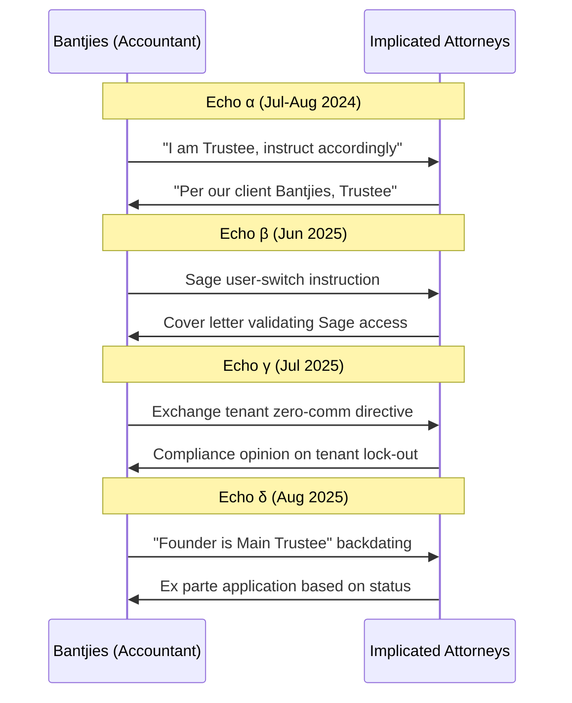

# ANNEXURE C: RECIPROCAL LIABILITY CORRESPONDENCE MAP
**Case:** 2025-137857
**Date:** 2 May 2026

This map demonstrates the mutually reinforcing channel between the Implicated Attorneys and the complicit Accountant (Bantjies).

## Temporal Echo Diagram

