# VOID AB INITIO WORKING REPORT
## Faucitt v Faucitt & Others, Case No. 2025-137857 (Gauteng Division, Pretoria)

**INTERNAL WORK PRODUCT — NOT FOR FILING. Supports the answering affidavit; the affidavit pleads the facts directly.**

Prepared: 11 June 2026. Built exclusively from the verified Foreknowledge Register (REGISTER / MATRIX / TRAIL PETER / TRAIL BANTJES / TRAIL ELLIOTT, all primary-verified this session except where a confidence label below says otherwise). Nothing outside the register is relied on. Items graded "disputed/unverified" are quarantined in §3 (NOT RELIED ON) and must not migrate into any pleading.

---

## 1. Executive Summary

**Core contention.** The ex parte order of 19 August 2025 (Kumalo J) — including paragraph 2.6, by which the Applicant took control of the third to sixth respondents' financial affairs "to the exclusion of the First, and Second Respondents", and paragraph 2.7 (expert appointment at the entities' cost) — was obtained without disclosure of documents the Applicant provably possessed which contradicted each leg of the case he put to the court ex parte. On the documentary record, the order falls to be **set aside or reconsidered** for material non-disclosure in breach of the duty of utmost good faith (*uberrima fides*) owed in ex parte proceedings, and the enforcement steps built on it — the account consolidation, the Mazars platform, the Second Application, and the unopposed-roll enrolment of Part B — **inherit that defect**. Until a court so orders, the order stands and is treated as operative; this report frames a case to be put, not a status already achieved.

**The foreknowledge spine (all proven, two-sided, primary):**

- **57 days** before e-filing, the Applicant was first addressee of FNB legal's ruling (18 Jun 2025, 16:51) that under the validly signed RegimA Worldwide Distribution (Pty) Ltd mandate "any of the directors of the company may act independently of each other." Not disclosed. *(KE_001, KE_006)*
- **65 days** before e-filing, the Applicant was on the To line of the 10 Jun 2025 thread in which the accountant tabled the computer-expense question openly and Daniel Faucitt demanded "an internal audit with extreme urgency" in writing — yet the founding affidavit timed the "discovery" to "during July 2025" (para 7.4) and justified the ex parte route by a fear the respondents "will conceal or destroy relevant documentation" (para 17.2). *(KE_002, KE_003, KE_006)*
- **2 business days** after the 18 Sep 2025 settlement signatures, written withdrawal (pleading duress, non-disclosure and voidness) was emailed to the Applicant's attorneys, who confirmed receipt in writing on 25 Sep 2025 — and **11 days after that confirmation** issued the Second Application to make the withdrawn agreements orders of court. *(KE_011, KE_013)*
- On **3 June 2026** the Applicant swore he had "merely interdicted" the respondents (AA 83.2; cf. 77.2, 185.2) against his own order's para 2.6 exclusion wording, and that the accountant is "fully independent of the entities and us" (AA 84.9) against his own "our accountant" wording (63.5, 89.2) and the C8 trustee/CFO records. *(KE_018, KE_019)*

**Agent classifications (measured, per the register's mandatory framings):**

| Agent | Classification | Basis |
|---|---|---|
| Peter Andrew Faucitt | Proven foreknowledge across 9 material facts; deponent of the non-disclosing founding affidavit and of the 3 Jun 2026 affidavit containing two two-sided oath collisions | KE_001–003, 006, 008–010, 016–019, 021 (all "proven") |
| D.J. (Danie) Bantjes | **Alarm-raiser, not participant.** Relevance: (a) timeline witness whose own 10 Jun 2025 analysis destroys the July-discovery narrative; (b) subject of an undisclosed conflict of interest (accountant + FFT trustee + George Group CFO). No complicity is alleged or supported (C7 contradicted) | KE_004, KE_005 (proven); KE_007, KE_022 (probable — held) |
| Elliott Attorneys Inc | Documented notice and timing only; **no professional-misconduct allegation is made**. The documents fix what the firm received, signed and filed, and when | KE_011, 013, 014, 015 (proven) |

---

## 2. Pillar-by-Pillar Analysis (register events only; confidence labels honest)

### Pillar 1 — Legal impossibility: the RWD banking mandate
**Fact:** FACT_RWD_MANDATE_IMPOSSIBILITY. **Event:** KE_001 — **proven**.

On Wednesday 18 June 2025 at 16:51, Mpumi Netshipale (FNB Commercial, after FNB engaged its legal department) emailed pete@regima.com (first addressee), d@rzo.io and JAX@REGIMA.COM: *"a decision was made that we have no need to hold a meeting with the Directors of REGIMA WORLDWIDE DISTRIBUTION (PTY) LTD as FNB cannot be held liable for acting in accordance with a validly signed mandate. The current mandate states that any of the directors of the company may act independently of each other."* The Applicant had corresponded on the same thread that morning (08:17). File: `E:\CASE\2025-06-18 - FNB Legal - Proof of FNB Sole Mandate for RegimA Worldwide Distribution (Pty) Ltd.pdf`.

**Consequence:** a director's transaction on a RegimA Worldwide Distribution (Pty) Ltd account could not be "unauthorized" vis-à-vis the bank mandate; the "defiance" framing of Jax's re-approach to the banks (founding 7.19) was made with this ruling in hand.

**Scope discipline (hard limit):** RWD accounts ONLY. This pillar does not reach Regima Skin Treatments CC, Strategic Logistics CC or Villa Via accounts, and does **not** apply to the R500,000 payment (which the Applicant's own AA 43.1 locates in Strategic Logistics CC).

### Pillar 2 — Material non-disclosure in the ex parte application
**Facts:** FACT_FOUNDING_NONDISCLOSURE; FACT_OPEN_SCRUTINY_JUNE2025. **Events:** KE_002, KE_003, KE_006 — **proven** (subject to the annexure caveat below).

The founding papers (e-filed 14 Aug 2025, 08:16:25) disclose neither the FNB legal letter nor the 26 May / 10 Jun 2025 correspondence: full-text search of the OCR'd body (deponent's narrative ends "Page 29/29"; OCR coverage pp 5–80 of 162) finds no occurrence of "mandate", no reference to FNB's legal position, and no reference to Dan's written audit demand. Instead:

- Para 7.3–7.4 times Bantjes' discovery to "during July 2025" — while Bantjes' own analysis, emailed to the Applicant on 10 Jun 2025 09:58, shows the computer-expense question tabled by 26 May / 10 Jun 2025, with Dan's "very professional and detailed analyses" acknowledged.
- Para 17.2 pleads fear that the respondents "will conceal or destroy relevant documentation" — without disclosing that Dan had, in writing, on the Applicant's own To line (10 Jun 2025, 11:45), demanded "an internal audit with extreme urgency" and warned that the RST transactions "must not be signed off as they will later show up as fraudulent."

Both colliding documents are primary and on disk. **Caveat (binding):** founding annexures pp 81–162 are not fully OCR'd — confirm no annexure discloses the FNB letter or the June thread before pleading the omission as absolute.

### Pillar 3 — False statements under oath with provable foreknowledge
**Facts:** FACT_OATH_EXCLUSION; FACT_OATH_BANTJES_INDEPENDENCE. **Events:** KE_018, KE_019 — **proven**. Each is a collision between two primary documents, both the Applicant's own; each must be pleaded citing both documents.

1. **"Merely interdicted" vs para 2.6.** AA (3 Jun 2026) 83.2: "The applicant was merely interdicted from acting to their prejudice"; 77.2: access to financial information "is not restricted"; 185.2: "precluded merely from participating in their financial administration." The order he sought and obtained provides at para 2.6 that he takes control "to the exclusion of the First, and Second Respondents" (verified verbatim in the 14 Aug 2025 e-filed bundle and the stamped FA5 copy in his own SCA petition).
2. **"Fully independent" vs the record.** AA 84.9: Bantjes is "fully independent of the entities and us." The same affidavit says "our accountant" (63.5; 89.2: "Subject to our accountant's decision, there may be nothing payable to the applicant"), and the C8 primary set (signed AFS, J401/J417 trust forms, subscription agreement) shows Bantjes is a Faucitt Family Trust trustee alongside the Applicant and CFO of The George Group. This is pleaded as the **Applicant's** false statement and non-disclosure of a conflict — Bantjes is its subject, not its author.

Framed as material false statements under oath; it is submitted that the para 2.6 collision, in particular, would in due course sustain a finding of perjury — that submission is made once, here, and is not repeated as an epithet anywhere in the papers.

### Pillar 4 — Direct admission with concealment: the cards
**Fact:** FACT_CARDS_ADMISSION_CONCEALMENT. **Event:** KE_021 — **proven**.

The founding affidavit admits the Applicant "took their cards" (17.1: the R500,000 was transferred "shortly after I took their cards") and pleads Jax's obtaining of duplicate/new cards "on or about 24 J[ul]y 2025" (7.19) as defiance — while concealing FNB legal's 18 Jun 2025 confirmation, sent to the Applicant himself, that under the RWD mandate any director may act independently and that change required a directors' resolution. The admitted act simultaneously proves the act and the deceptive framing. **Caveat:** the card-taking admission spans the corporations generally — tie each card to its entity before pleading entity-specific conclusions; the mandate point is RWD-only.

### Pillar 5 — The spent trigger: the R500,000 concession
**Fact:** FACT_R500K_TRIGGER_SPENT. **Event:** KE_010 — **proven** (adversary-sworn).

The R500,000 payment of 16 Jul 2025 was the featured, urgency-creating ground of the ex parte application (founding 7.20 "which I did not authorise"; 16.5 "it became clear that action had to be taken"; 17.1 "immediately and defiantly transferred... shortly after I took their cards"). The Applicant's 3 Jun 2026 AA now swears (39.3) it "was accepted, and required no investigation, through the mediation so held" (18 Sep 2025) and (39.4) is "no longer the main contender in this matter." On his own oath, the order's featured justification was spent from 18 Sep 2025, while the para 2.6 exclusion regime and Part B momentum continued. **Note:** his 43.1 attributes the payment to Jax via Strategic Logistics CC while Jax's RE3/RE4 name Dan as transactor — double-edged; Dan's own factual account remains [DAN TO CONFIRM] and is not asserted here.

### Pillar 6 — Withdrawal-and-enforcement pattern: the settlements and the Second Application
**Fact:** FACT_SETTLEMENT_WITHDRAWAL_ENFORCEMENT. **Events:** KE_011 (**proven**), KE_013 (**proven**), KE_012 (Peter-personal knowledge — **probable**, imputed via his attorneys and demonstrated by litigation conduct).

Settlements signed 18 Sep 2025. Written withdrawal — alleging duress, material non-disclosure, illegality and procedural irregularity — emailed Monday 22 Sep 2025 13:21 to ENS (S Munga) and Elliott (keegan@): the second business day after signature. Keegan Elliott confirmed receipt in writing 25 Sep 2025 08:28. Notwithstanding, the Second Application to make those agreements orders of court was created/filed 3 Oct 2025 (PDF creation 08:48:56) and remains live (JH16; enrolled with Part B by JH15).

**Honest framing (binding):** the duress allegations are the respondents' assertions, not yet findings. What is **proven** is (i) the speed and content of the withdrawal — the documented antithesis of acquiescence — and (ii) the attempt, on confirmed written notice of the voidness contentions, to convert the agreements into court orders.

### Pillar 7 — Unopposed-roll enrolment with sworn knowledge of standing opposition
**Fact:** FACT_UNOPPOSED_ENROLMENT. **Events:** KE_014, KE_015, KE_016 — all **proven**.

On 14 May 2026 (Court Online stamps 14:07:00 / 14:07:18) Elliott filed JH15 — "NOTICE OF SET DOWN — UNOPPOSED MOTION" for Part B, the First Application and the Second Application, hearing date left **blank** — and a practice note stating "Attorney for First and Second Respondent: N/A." Yet JH17, the Notice of Intention to Oppose for **both** respondents (Ian Levitt Attorneys, 20 Oct 2025, served on Elliott via email), is on the record and was annexed by the Applicant himself; Levitt's 14 Nov 2025 withdrawal withdrew the attorneys, not the notice. The Applicant swears in one breath that the notice exists (AA 24.9) and that he is entitled to the unopposed roll under "Paragraph 13.10 of the Practice Manual" because no answering affidavit followed (24.5, 24.10).

**Operational consequence:** the exposure is procedural and is extinguished by **delivering the answering affidavit with condonation**, which forces the opposed roll; in the alternative the enrolment is challengeable if effected without proper service of a **dated** set-down on every respondent. **Caveat:** read Practice Manual para 13.10 before attacking the enrolment as irregular rather than simply mooting it.

### Pillar 8 — Post-order control architecture (supports the Part B answer; inherits the para 2.6 defect)
**Facts:** FACT_SWEEP_EXCLUSIVE_CONTROL; FACT_MAZARS_AUP_PLATFORM. **Events:** KE_008, KE_009, KE_017 — all **proven**.

- On/about 3 and 11 Sep 2025, funds in the four entity FNB current accounts were transferred to the entities' **own** savings/investment accounts under the Applicant's exclusive para 2.6 control — admitted at AA 62.4 ("Funds... were indeed transferred to savings accounts for the entities") and 65.3 ("held in investment accounts, safe from harm's way"). **Plead only "swept/consolidated under the Applicant's exclusive control" — never "emptied/stolen/dissipated."** For amounts, cite the Applicant's own bank-issued JH26/JH27 set; the respondent-generated 17 Feb 2026 compilation is corroboration only.
- The Forvis Mazars engagement is an ISRS 4400 agreed-upon-procedures engagement "agreed upon with Regima Skin Treatments CC" by engagement dated **17 Sep 2025** — an entity under the Applicant's exclusive control since 19 Aug 2025 — one day before the mediation and six days after the sweeps. Report signed JJ Eloff, 11 Mar 2026; operative finding "Value of computer expenses that could not be substantiated — R10,847,862"; deployed as the Part B platform by JH14, served 18 Mar 2026 11:17. The respondents were locked out (paras 2.6/2.8) of the systems holding the SaaS invoices while "missing invoices" were measured against records supplied solely by the Applicant-controlled entity. The Applicant's sworn gloss — "misappropriated" (21.3), "we do not conduct computer related business" (21.7.1), "embezzled, and squandered" (21.8) — **appears nowhere in the report**.

> **THREE ~R10m FIGURES — NEVER CONFLATE:** (1) Mazars **R10,847,862** "could not be substantiated" (computer expenses, AUP, 11 Mar 2026); (2) the **~R10m sweep** of entity FNB current accounts to the entities' own savings under the Applicant's exclusive control by 11 Sep 2025; (3) Bantjes' **"R10m year-on-year decline"** for the Group (10 Jun 2025 analysis). Three different things, three different dates, three different documents.

---

## 3. NOT RELIED ON — excluded or held items (do not let these creep back)

| Item | Status | Why excluded |
|---|---|---|
| Bantjes complicity / "dismissed the audit" / "consciousness of guilt" | **Contradicted (C7)** | The primary record shows Bantjes RAISED the alarm (10 Jun 2025 analysis) and his 15:33 reply was a deferral by an accountant going on leave, not a dismissal (Matrix rows 2–4). The only pleadable point is Peter's "fully independent" oath vs the conflict records (Pillar 3.2). |
| Sage dual-login (SF10) | **Unverified** | Not primary-verified; excluded from the register entirely. |
| "Fabricated 2019 AFS" | **Document proven; fabrication element unverified** | The Regima SA (Pty) Ltd AFS "for the 15 months ended 28 February 2019", issued 25 Jun 2025, IS on disk (Matrix row 6) — but no CIPC name-history proof exists on disk and no instruction by the Applicant is sourced. The temporal-impossibility pillar cannot be run without that proof. |
| PF6 (Bantjes confirmatory affidavit) — Pillar "Supporting Affidavit" limb | **Probable; HELD (KE_007)** | PF6 has not been read/OCR'd. If it adopts the July-2025 discovery narrative it collides with Bantjes' own 10 Jun 2025 emails — but nothing may be pleaded on it until it is obtained and read. Conflict-not-complicity framing remains mandatory either way. |
| AA 63.2 "no sales whatsoever" oath collision | **Possible; HELD (KE_020)** | AA 63.3 (staff loaded orders onto Shopify) is the escape hatch. The Shopify exports must prove **channel origination** before this is pleaded as a false oath (N7). Until then: internal tension, argument only. |
| Peter's personal receipt of the withdrawal notice | **Probable (KE_012)** | Knowledge is imputed via his attorneys' confirmed receipt and his litigation conduct; no document addressed to him personally is verified. Plead via the attorneys. |
| 26 May 2025 Bantjes email | **Inferred (Matrix row 1)** | Referenced inside the 10 Jun email but not on disk; do not assert its contents or recipients. |
| KE_022 (Bantjes' knowledge of his own roles) | **Probable** | Conflict-timeline anchor only; pinpoint the trust-form signatures in ketoni_evidence_archive before pleading dates. |
| "Audit trail wiped/destroyed 22 May" | **Prohibited framing (C2)** | Plead only the SA-store revenue cut-off; the "stop" is adversary-admitted (AA 63.5/63.8) and adversary-expert-dated (JH13: 26 May 2025). |
| R900k Feb-2025 transfers; R5.4m stock/Adderory; R10.27m aggregate; R18.685m Ketoni payout; "Kayla/proceeds of murder/estate" gloss; "Rynette's son owns Adderory" | **Unsourced / quarantined (C3, C4, C10, C5)** | No primary sourcing; some are AI aggregates; all stripped. |

---

## 4. Knowledge Matrix — who provably knew what, when

| # | Date/time (SAST) | Agent | What they provably knew / did | Pinpoint proof | Confidence |
|---|---|---|---|---|---|
| 1 | 26 May 2025 | Bantjes (→Peter?) | First computer-expense email existed ("my email of 26th May"); Dan had already responded in detail | Referenced inside 10 Jun 2025 09:58 email; the 26 May email itself NOT on disk | inferred |
| 2 | 10 Jun 2025 09:58 | Peter, Jax, Dan (To line) | First-ever substantial group trading loss; "decline of R10m year-on-year... including Villa Via"; computer expenses >20% of revenue need justification; Dan's analyses "very professional and detailed" | `E:\CASE\2025-06-10 - Bantjies - The RegimA Group results and Computer Expense analysis.pdf` | proven |
| 3 | 10 Jun 2025 11:45 | Peter (To line) | Dan demanded "an internal audit with extreme urgency"; warned RST transactions "must not be signed off as they will later show up as fraudulent"; accounts "exist solely on Rynette's computer" | same PDF (Dan's reply) | proven |
| 4 | 10 Jun 2025 15:33 | Bantjes (CC Peter) | Bantjes deferred ("under consideration in due course... away for 2 weeks") — deferral, NOT dismissal | `E:\CASE\Bantjies Response 2 weeks.pdf` | proven |
| 5 | 18 Jun 2025 16:51 | Peter (first addressee), Dan, Jax | FNB legal: any RWD director may act independently of the others — RWD ONLY | `E:\CASE\2025-06-18 - FNB Legal - Proof of FNB Sole Mandate for RegimA Worldwide Distribution (Pty) Ltd.pdf` | proven |
| 6 | 25 Jun 2025 | (instructing party unknown) | Regima SA (Pty) Ltd AFS "15 months ended 28 Feb 2019" ISSUED 25 Jun 2025 | CASEJ\...\fake_accounts\RegimaSA(Pty)Ltd-2019-Financialstatements-SME.pdf | document proven; fabrication claim UNVERIFIED — excluded |
| 7 | 16 Jul 2025 | Peter | R500,000 Strategic Logistics CC → Dan ("birthday gift") — the featured ex parte ground | Founding 7.20, 16.5, 17.1; AA 43.1 | proven (event + featured role) |
| 8 | 5 Aug 2025 | Peter | Approached Elliott for advice (his sworn chronology) | Founding 16.7 | proven (as his version) |
| 9 | 14 Aug 2025 08:16:25 | Peter + Elliott | Founding papers e-filed: NO mandate/FNB letter/June correspondence/audit demand; discovery timed to "during July 2025" (7.4); fear of document destruction (17.2); admits "I took their cards" (17.1) | 1.MAT4719-NOMandFoundingAffidavitandAnnexures.pdf (OCR pp 5–80) | proven (annexure caveat) |
| 10 | 19 Aug 2025 | Peter + Elliott | Order granted ex parte incl. para 2.6 "to the exclusion of..." and para 2.7 | 2025_08_19_-_Peter_Faucitt_Interdict.pdf; stamped FA5 in 20260601084507289.pdf | proven |
| 11 | 3 + 11 Sep 2025 | Peter | Entity current-account funds swept to entities' OWN savings/investment accounts under his exclusive control | AA 62.3–62.4, 65.3 (admissions); respondent compilation corroboration only | proven (transfers); amounts via JH26/JH27 |
| 12 | 17 Sep 2025 | Peter | Mazars AUP engagement concluded with Peter-controlled RST CC — 1 day before mediation, 6 days after sweeps | JH13 p.033-22 | proven |
| 13 | 18 Sep 2025 | Peter, Dan, Jax | Settlements signed; R500k "was accepted, and required no investigation, through the mediation" (his 2026 oath) | AA 39.2–39.4; JH15 practice note 5.1.2 | proven |
| 14 | 22 Sep 2025 13:21 | Elliott + ENS | Written withdrawal from the settlements (duress, non-disclosure, voidness) emailed — 2nd business day after signing | CASEJ\2025-09-22_-_Notice_of_Withdrawal.pdf | proven |
| 15 | 25 Sep 2025 08:28 | Elliott (express); Peter (imputed) | "We confirm receipt of the notice of withdrawal" | `E:\CASE\2025-09-25 - Elliot Attorneys - We confirm receipt of the notice of withdrawal.pdf` | proven / probable (Peter) |
| 16 | 3 Oct 2025 08:48 | Elliott + Peter | Second Application: make the WITHDRAWN agreements orders of court | KF0019-SecondApplication-03.10.2025.pdf | proven |
| 17 | 20 Oct 2025 | Elliott (service recipient) | JH17 Notice of Intention to Oppose for BOTH respondents on record | JH17 (009-1..3) | proven |
| 18 | 14 Nov 2025 | Elliott, Peter | Levitt withdrew as ATTORNEYS — not the opposition notice | 11. MAT4719 - Notice of Withdrawal as Attorneys of Record.pdf | proven |
| 19 | 11 Mar 2026 | Mazars (JJ Eloff) → Peter | AUP report signed: R10,847,862 "could not be substantiated"; RST last Shopify transaction 26 May 2025; ISRS 4400, no assurance, no person named | JH13 signature page | proven |
| 20 | 18 Mar 2026 11:17 | Elliott → respondents | JH14 supplementary founding affidavit (Mazars platform) served electronically | JH14 p.033-69 service email | proven |
| 21 | 14 May 2026 14:07 | Elliott + Peter | JH15 unopposed-roll set-down, hearing date BLANK; practice note "Attorney for First and Second Respondent: N/A" | JH15 + practice note (Court Online stamps) | proven |
| 22 | 3 Jun 2026 | Peter | "Merely interdicted" (83.2/77.2/185.2) vs para 2.6; "fully independent" (84.9) vs 63.5/89.2 + C8; "no sales whatsoever" (63.2) vs 63.3 [HOLD]; admits JH17 (24.9) while claiming unopposed roll (24.10); "was informed by Bandjies of discrepancies" mid-2025 (54.2.1); "Ms Farrar acts on my instructions only" (64.2); stock order 2026-115880 (7.5) | F-first-respondents-answering-affidavit.pdf (OCR) | proven (paragraph wording) |

---

## 5. Timeline (mermaid source)

```mermaid
timeline
    title Foreknowledge timeline — Faucitt v Faucitt 2025-137857 (verified register events)
    section Foreknowledge window (pre-application)
        2025-05-26 : Bantjes' first computer-expense email (referenced only — inferred, not on disk)
        2025-06-10 : 09h58 Bantjes group-results analysis to Peter, Jax, Dan (proven)
                   : 11h45 Dan's written reply demands urgent internal audit (proven)
                   : 15h33 Bantjes defers — away 2 weeks (proven)
        2025-06-18 : 16h51 FNB legal email to Peter (first addressee), Dan, Jax — any RWD director acts independently (proven)
        2025-07-16 : R500,000 Strategic Logistics CC payment to Dan — later the featured ex parte ground (proven)
        2025-08-05 : Peter consults Elliott (his sworn chronology)
    section Ex parte application and order
        2025-08-14 : 08h16 founding papers e-filed — no FNB letter, no June thread, discovery timed to "July 2025" (proven, annexure caveat)
        2025-08-19 : Order granted (Kumalo J) — para 2.6 exclusion, para 2.7 expert appointment (proven)
    section Post-order control and settlements
        2025-09-03 : First entity current-account transfers to own savings under exclusive control (admitted)
        2025-09-11 : Further transfers — consolidation complete (admitted)
        2025-09-17 : Mazars AUP engagement agreed with Peter-controlled RST CC (proven)
        2025-09-18 : Mediation — settlements signed — R500k "accepted, required no investigation" per his 2026 oath (proven)
        2025-09-22 : 13h21 written withdrawal from settlements emailed to ENS and Elliott (proven)
        2025-09-25 : 08h28 Elliott confirms receipt in writing (proven)
        2025-10-03 : Second Application issued to enforce the withdrawn agreements (proven)
        2025-10-20 : JH17 notice of intention to oppose (both respondents) served on Elliott (proven)
        2025-11-14 : Levitt withdraws as attorneys — opposition notice stands (proven)
    section Part B platform and enrolment
        2026-03-11 : Mazars AUP report signed — R10,847,862 "could not be substantiated" (proven)
        2026-03-18 : 11h17 JH14 supplementary founding affidavit served electronically (proven)
        2026-05-14 : 14h07 JH15 unopposed-roll set-down, date blank — practice note "Attorney for 1st and 2nd Respondent N/A" (proven)
        2026-06-03 : Peter's AA — "merely interdicted" vs para 2.6 — "fully independent" vs own records — JH17 admitted alongside unopposed-roll claim (proven)
```

---

## 6. Legal Consequences (measured)

1. **The ex parte duty.** An applicant who approaches a court ex parte owes a duty of utmost good faith: all material facts — including those adverse to the application — must be disclosed. Where material non-disclosure is shown, the order obtained **falls to be set aside or reconsidered** (including on reconsideration at the instance of a party affected by an order granted in their absence); the court retains a discretion, which is why the answering papers must put the colliding primary documents themselves before the court rather than characterisations of them.
2. **What the record supports here.** The non-disclosure was material on the founding affidavit's own logic: the FNB mandate ruling negated the "unauthorized transaction" framing for RWD accounts; the June correspondence negated both the "July discovery" timeline and the "will conceal or destroy documentation" justification for proceeding without notice. Each leg is proven by a two-sided documentary collision (§2, Pillars 1–3).
3. **Enforcement steps inherit the defect.** Everything built on the para 2.6 exclusion stands or falls with the order: the account consolidation under exclusive control (Pillar 8), the Mazars engagement agreed by the Applicant-controlled entity under para 2.7 while the respondents were locked out of the invoice-bearing systems, the supplementary founding affidavit resting on that report, and the enrolment of Part B. If the order is set aside or reconsidered, the evidentiary platform of Part B must be re-evaluated on a record the respondents could answer. This is put no higher than that: no assertion of malicious prosecution is made, and the relief sought is procedural and restorative, not punitive.
4. **The false-statement cluster.** The two proven oath collisions (para 2.6 "to the exclusion of" vs "merely interdicted"; "fully independent" vs "our accountant" + trustee/CFO records) are pleaded as material false statements under oath, each time citing both colliding documents. The single perjury submission is made once, in §2 Pillar 3, and nowhere else.
5. **The settlements.** The proven facts are the two-business-day written withdrawal and the enforcement attempt on confirmed notice of the voidness contentions. The duress allegations remain the respondents' case to make; the speed and content of the withdrawal are the objective antithesis of acquiescence, and the word "repudiation", if deployed, is answered on that record.
6. **The unopposed roll.** A live notice of intention to oppose (JH17) is on the record and is admitted on oath (AA 24.9). The procedural gap — no answering affidavit — is the route being exploited and is the gap this work closes; it is extinguished by delivery, with condonation, of the answering affidavit.

---

## 7. Recommendations (limited to the litigation steps actually in train)

1. **Deliver the answering affidavit to Part B and the JH14 supplementary founding affidavit, with a substantive condonation application**, as the primary and urgent step. This moots the unopposed-roll route (KE_016: the Applicant's own entitlement theory depends on the absence of an answering affidavit) and forces the matter to the opposed roll.
2. **In the same papers, seek reconsideration / setting aside of the 19 Aug 2025 order** on the material non-disclosure and false-statement grounds in §2, pleading the colliding primary documents in pairs and within the scope limits (RWD-only mandate; "swept under exclusive control"; three R10m figures kept separate).
3. **Oppose the Second Application** on the proven withdrawal-and-enforcement record (KE_011, KE_013), with the duress narrative confined to what Dan and Jax can themselves depose to ([DAN TO CONFIRM] blocks where his personal knowledge is needed).
4. **Object to any unopposed-roll enrolment** effected without proper service of a **dated** set-down on every respondent — after first reading Practice Manual para 13.10 (unchecked; see caveats).
5. **Service/representation framing:** plead "the order was never formally served on me (no return of service exists); I was shut out procedurally" — never "I never knew of the order." Note Elliott's own email-service practice (Rule 7(1) notice 3 Mar 2026; JH14 service 18 Mar 2026) rebuts any suggestion that email filings from a litigant in person are invalid.
6. **Pre-filing verification tasks (mandatory before the corresponding paragraphs are pleaded):** (a) OCR founding annexures pp 81–162 to confirm the non-disclosure is absolute; (b) obtain and read PF6 before any supporting-affidavit contention; (c) cross-check every AA paragraph pinpoint against the served copy (scan-OCR caveat); (d) resolve the 2026-115880 case-number collision on Court Online before citing it; (e) pinpoint the C8 trust-form signature dates; (f) channel-origination proof before any use of the AA 63.2/63.3 tension beyond argument.

---

## 8. Standing caveats (carried from the register — binding on all downstream drafting)

- AA paragraph numbers were read from scan OCR (CaseLines 049-x stamps): re-verify each pinpoint against the served copy before citation in a filing.
- Founding annexures pp 81–162 not fully OCR'd: the non-disclosure is verified for the affidavit body and OCR pp 5–80 only.
- PF6 unread; 26 May 2025 email not on disk; Peter's personal receipt of the withdrawal notice is probable (imputed), not proven.
- Practice Manual para 13.10 unread.
- All §3 exclusions remain excluded. Bantjes is pleaded as conflicted alarm-raiser only. RegimA Zone Ltd (UK, HSBC) ≠ RegimA Zone (Pty) Ltd (SA, FNB, 2017/110437/07) ≠ Rezonance (Pty) Ltd (SA, 2017/081396/07) — identify precisely every time.

---

## ADDENDUM (12 Jun 2026) — Leads recorded from Dan, NOT FOR FILING in the Part B answer

Recorded so they are not lost; none is currently primary-sourced in the archive, and all fall under the C5/C3 quarantine for the Part B answering affidavit. If pursued, they belong in the criminal/SAPS track or in Jax's own papers, only once primary-sourced:

1. **15 May 2025 — Jax's discovery**: Dan states Jax found "missing money" owed to Rezonance (Pty) Ltd and to Kayla Pretorius's estate, and confronted Ms Farrar, insisting on payment ahead of a July 2025 meeting with the detectives investigating Kayla's murder (13 Jul 2023). No contemporaneous document for the 15 May discovery/confrontation is in the archive — search Jax's mailboxes for May 2025 correspondence before any use.
2. **July 2025 — detectives turned away**: Dan states that when the detectives arrived at the office, Ms Farrar told them Dan and Jax were not present and sent them away, while both were inside waiting. Explosive if provable; currently witness-recollection only. Corroboration paths: SAPS occurrence book / detectives' own notes (obtainable via the investigating officer), office access/CCTV records, contemporaneous messages. Until corroborated, NOT pleadable anywhere.
3. **R4.2M / R5.4M figures — RESOLVED (12 Jun 2026, later same day)**: not in the email body, but FOUND in `Summarised TB's all co's (1).xlsx` (folder `...\evidence\correspondence\dan-bantjies-jun2025\`), which matches Bantjes' 09:58 in-thread reference to "the Excel printouts I've attached". Strategic Logistics sheet: Inventory Control – Finished Goods **R4,199,539.63** (≈ Dan's "4.2M"); Nett Loss **R5,433,076.04** (≈ Dan's "5.4M"); also Inventory Adjustment **R5,241,372.98** (probable true origin of the quarantined "R5.4m stock" claim — three distinct ~R5M figures, never conflate); and SL INTERNAL: single REGIMA Tax Invoice **SIN30813, 19/02/25, R5,200,000 + R780,000 VAT = R5,980,000** — the one genuine single large transaction in the visible rows. Now conditional **DF34** in the filing pack; provenance must be closed by finding the originating email carrying this attachment (search dan@regima.com / d@rzo.io for "Summarised TB") before annexing. The quarantine on "R5.4m stock" as previously phrased REMAINS — what is now permitted, once provenance is closed, is pleading the specific TB lines, correctly labelled (balances, not transactions; only SIN30813 is a transaction).
4. **The affidavit's verified versions remain the pleadable ones**: urgent-audit demand (DF23 paras), Rezonance indebtedness per the email's own words, and the custody/Sage record. No Kayla-related material appears in the Part B answer, by design.

---

## ADDENDUM 2 (13 Jun 2026) — SARS-fraud & backdated-accounts material RESERVED for the criminal/SARS track (NOT for the Part B answer)

Per Dan's instruction, the fuller (reserved) version of the June-2025 sequence and the RegimA-SA backdated-accounts angle is recorded here for the criminal complaint / SARS disclosure / any counter-application — it is deliberately kept OUT of the sworn Part B answering affidavit (where only the calibrated, document-anchored versions appear). Cross-ref the full verification in `09_DANIE_FOLDER_FINDINGS.md` (Timeline-Assertion Check).

### A. The early-June SARS-invoice sequence (verified; reserved framing)
- **5 Jun 2025**: SARS VAT query on the two big end-Feb inter-company invoices reaches Peter's phone ("Anton forwarded the letter via WhatsApp to Pete's phone" — Rynette, 000271).
- **6 Jun 2025 09:29**: Rynette to Bantjes — *"The two big invoices were done on your request, for which I have no answer"*; and 5 Jun — *"pushed through at the end of February"*, *"Can you give us the explanation to SARS in writing so that I can put it on a letterhead?"* (000271/000277).
- **6 Jun 2025 09:50**: Bantjes — ***"I will manufacture an answer to the 2 interco invoices over the weekend"*** (000277, Cc Pete). ⛔ KEPT OUT of the sworn affidavit (benign-reading + C7 + concedes the transaction suspect). USABLE in a SARS/SAPS complaint as part of the chain (bookkeeper says invoices unexplained + done on accountant's request → accountant undertakes to construct the SARS answer → DF42 docx authored by Bantjes over that weekend, core.xml dc:creator="Danie Bantjes" rev7 8–9 Jun). To allege fraud-on-SARS the chain still needs: proof the invoices lacked commercial substance + that the submission was false + intent.
- **~7 Jun 2025**: business cards cancelled (founding 7.7 admits; JH9 cl 2.3.1 reimburses Dan "from 7 June 2025"). The "next-day retaliation after Dan's 6-Jun report" framing needs Dan's 6-Jun report date + a primary cancellation record before it can be asserted as causal.
- **NOT supported**: "Rynette admitted 4.2m missing stock on 6 Jun" — she did not; see 09_DANIE check item 1.

### B. RegimA SA (Pty) Ltd (2017/087935/07) — former name "K-Oz Creative" + backdated 2019/2021 accounts (UNDER PRIMARY VERIFICATION as of 13 Jun 2026)
Source so far = analysis summary only (`..._ANALYSIS_WORKSPACE\extracted_text\other\Rynette_Farrar_&_De_Novo_..._Correspondence_Archive (1).docx.txt`). Asserts: 2017/087935/07 was formerly **K-Oz Creative**; **CoR39 = Peter added as director 2021-03-08**; De Novo engaged Mar 2025 by Peter (via Rynette) to *reconstruct* records; **backdated AFS for 2019 (signed by Peter 25 Jun 2025) and Feb-2021 produced in 2025**; De Novo "spoke to Danie [Bantjes]" re the SARS practitioner profile. **A workflow is verifying the primary CoR39/CIPC record + relevance + double-edge.**
⚠️ **DOUBLE-EDGE (why this is NOT auto-included):** the same archive records Peter directing the engagement (helps the "Peter controlled it" theme), but ALSO a SUMMARY claim that **Dan signed the Public Officer resolution appointing Peter (19 Mar 2025)** — ⛔ **DISPUTED/summary-only: Dan says he REFUSED to sign it (witness available); no signed resolution is on disk; do NOT assert one exists** (corrected 13 Jun 2026 per Dan; refusal-with-witness reserved for reply if Elliott produces a document) — and **Rynette deflecting: "All transfers were done by Barend from Dermal Skin and Daniel Faucitt. I have no clue."** (also summary-only). RegimA SA is a NON-respondent. Inclusion in the Part B answer is pending the workflow verdict.
